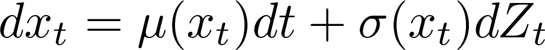
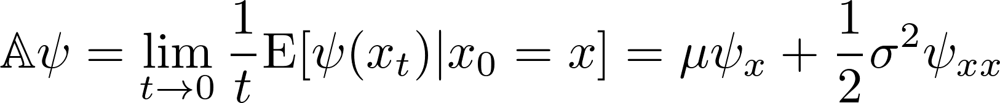
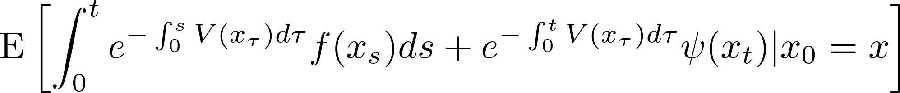
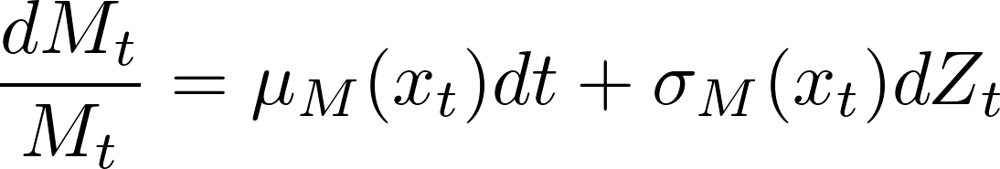
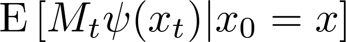

## Markov Process
For a diffusive process 
- `generator(x, μx, σx)` returns the infinitesimal generator of `x` 

- `stationary_distribution(x, μx, σx)` returns the stationary distribution of `x`.
- `feynman_kac_forward(x, μx, σx; t, ψ, f, V)`	returns 

## Multiplicative Functional
For an associated multiplicative functional 
- `generator(x, μx, σx, μM, σM)` returns the infinitesimal generator of `x` tilted by `M` 
- `hansen_scheinkman_decomposition(x, μx, σx, μM, σM)` returns the Hansen-Scheinkman decomposition of `M`.
- `feynman_kac_forward(x, μx, σx, μM, σM; t, ψ)` returns  
- `impulse_response(x, μx, σx, μM, σM; t, σD)` returns  `σD(x) * (σM + σE[M_T | X_0 = x])`.

